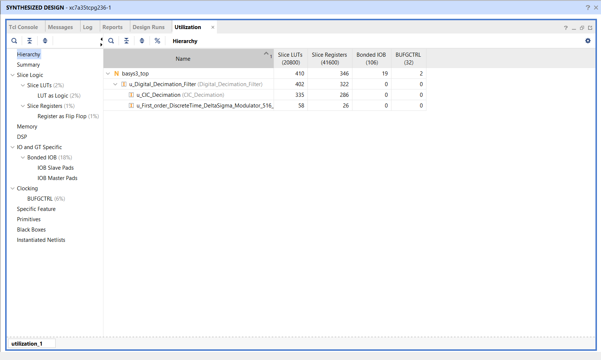
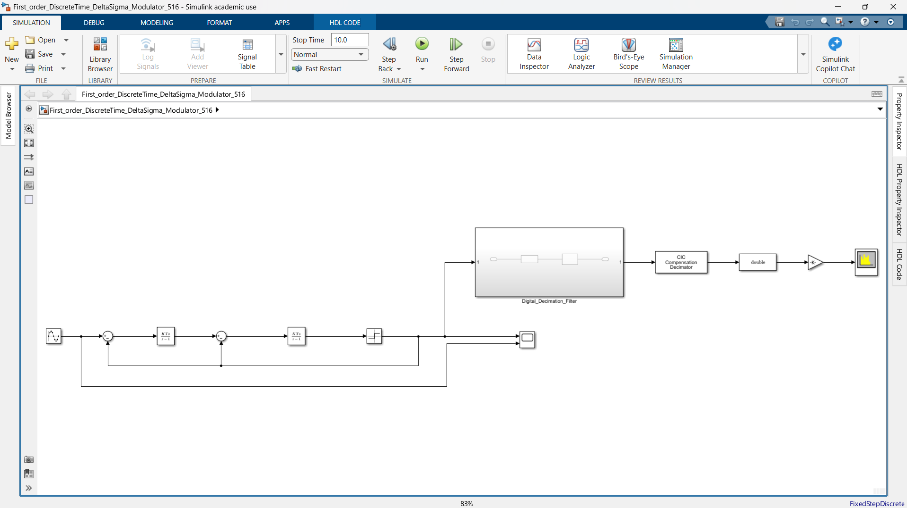
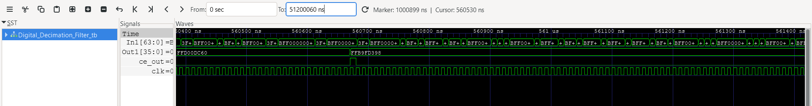
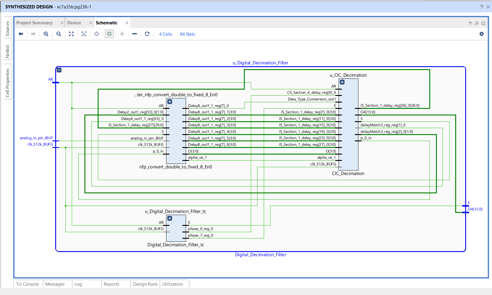

# 1-Bit Delta-Sigma ADC to 36-Bit CIC Decimation Filter (FPGA RTL)

## Executive Summary

This repository contains the synthesizable Register-Transfer Level (RTL) Verilog design and FPGA hardware verification for a **Multi-Rate Mixed-Signal Interface**: a 1-Bit Delta-Sigma Analog-to-Digital Converter (ADC) front-end coupled with a 36-Bit Cascaded Integrator-Comb (CIC) Decimation Filter.

In modern ASIC and SoC architectures (GPUs, AI accelerators, mobile processors), interfacing with continuous real-world analog signals requires high-precision conversion without consuming massive silicon area. This project replaces traditional, hardware-expensive multi-bit ADCs by utilizing **1-bit Pulse Density Modulation (PDM)** at an extreme oversampling rate ($512 \text{ kHz}$), followed by a multiplier-free digital decimation pipeline that downsizes the frequency while expanding data precision to a pristine **36-bit baseband integer** ($4 \text{ kHz}$).

---

## System Architecture

The architecture bridges the analog/digital boundary across three distinct clock and frequency domains using a multiplier-free hardware design:

1. **Clock Domain Translation (`basys3_top.v`):** The master $100 \text{ MHz}$ quartz oscillator of the Basys 3 board is divided down by a factor of 195 to generate the synchronous $512 \text{ kHz}$ oversampling clock required by the modulator.
2. **Delta-Sigma Modulator Front-End:** An analog voltage stream is converted into a 1-bit high-frequency pulse density train. A solid High ($+1.0$) is mapped to `64'h3FF0000000000000`, and a Low ($-1.0$) is mapped to `64'hBFF0000000000000`.
3. **CIC Decimation Core (`CIC_Decimation.v`):** Operating at $512 \text{ kHz}$, internal integrator accumulators continuously sum the incoming bitstream. A downsampling timing controller (`Digital_Decimation_Filter_tc.v`) fires a hardware strobe (`ce_out`) every **128 clock cycles**, sampling the accumulator and dropping the high-frequency quantization noise.
4. **Physical LED Bus Mapping:** The top 16 active bits of the 36-bit decimated integer are routed to physical FPGA output pins to visually demonstrate real-time hardware signal integration.

---

## Technical Specifications

| Parameter | Specification | Engineering Rationale |
| :--- | :--- | :--- |
| **Front-End Architecture** | 1st-Order Discrete-Time $\Delta\Sigma$ Modulator | Trades instantaneous precision for raw sampling speed |
| **Back-End Filter** | Multi-Stage CIC Decimator | **Multiplier-Free Math:** Uses only adders, subtractors, and registers |
| **Oversampling Ratio (OSR)** | $R = 128$ | Provides significant quantization noise suppression at baseband |
| **Master Clock ($f_{clk}$)** | $100 \text{ MHz}$ | Standard crystal oscillator on Xilinx Artix-7 development boards |
| **Sampling Frequency ($f_s$)** | $512 \text{ kHz}$ | Derived via custom RTL synchronous clock divider |
| **Baseband Output ($f_{out}$)** | $4 \text{ kHz}$ | Exact Nyquist rate output after $R = 128$ decimation |
| **Internal Resolution** | 36-Bit Signed Integer | Prevents mathematical overflow during massive integration cycles |
| **Target Hardware** | Xilinx Artix-7 (`xc7a35tcpg236-1`) | Digilent Basys 3 FPGA Development Board |

---

## Hardware Resource Utilization

A critical design requirement for mixed-signal ASIC wrappers is minimizing logic overhead. By choosing a CIC filter topology instead of a Finite Impulse Response (FIR) filter, **zero expensive DSP multiplier slices** were consumed.

As extracted directly from the AMD Vivado Post-Synthesis Utilization Report for the target Artix-7 (`xc7a35tcpg236-1`) FPGA:

* **Slice LUTs:** `410 / 20,800 (2%)` — Extremely lightweight logic footprint across the top wrapper and decimation filter.
* **Slice Registers:** `346 / 41,600 (1%)` — Highly efficient storage utilization for the 36-bit integration accumulators and delay lines (mapped as standard Flip-Flops).
* **Bonded IOB (Input/Output Buffers):** `19 / 106 (18%)` — Physical pin connections allocated for the master clock, reset button, 1-bit PDM input stream, and the 16-bit LED output bus.
* **Clock Buffers (BUFGCTRL):** `2 / 32 (6%)` — Dedicated low-skew routing buffers for the $100 \text{ MHz}$ master and $512 \text{ kHz}$ divided clock domains.
* **DSP Slices (Multipliers):** `0 / 90 (0%)` — Complete elimination of hardware multipliers, proving optimal silicon area efficiency.

---

## Repository Structure

    ├── rtl/                                                       # Synthesizable Hardware Sources
    │   ├── basys3_top.v                                           # Top-level physical board wrapper & clock divider
    │   ├── Digital_Decimation_Filter.v                            # Main decimation subsystem interconnect
    │   ├── CIC_Decimation.v                                       # Multiplier-free Integrator-Comb filter core
    │   ├── Digital_Decimation_Filter_tc.v                         # R = 128 downsampling timing controller
    │   └── nfp_convert_double_to_fixed_8_En0.v                    # Fixed-point data format converter
    │
    ├── tb/                                                        # Verification & Simulation Benches (Testbenches)
    │   ├── basys3_tb.v                                            # Full system behavioral testbench (10ms timeline)
    │   └── Digital_Decimation_Filter_tb.v                         # Algorithmic core testbench (File I/O)
    │
    ├── constraints/                                               # Physical FPGA Mapping
    │   └── basys3_pins.xdc                                        # Xilinx Design Constraints for Basys 3 (Artix-7)
    │
    └── docs/                                                      # Verification Datasheet & Visual Evidence
        ├── simulink_model.png                                     # Golden Reference mathematical Z-domain model
        ├── Block Diagram Delta-Sigma-Filter.png                   # Architectural data-flow schematic
        ├── gtkwave_decimation.png                                 # Core RTL timing verification screenshot
        ├── Vivado Waveform.png                                    # Physical XSIM 10ms hardware verification
        ├── utilization_report.png                                 # Synthesis Slice LUT/Register resource counts
        └── synthesized_schematic.png                              # Gate-level physical schematic (Vivado F4)

---

## Silicon Proof & Verification

The architecture was designed using a top-down verification methodology, starting from a Z-domain mathematical model and culminating in physical gate-level behavioral timing analysis.

### 1. Golden Reference Model (Simulink)
The decimation algorithms were first prototyped and simulated in Simulink to establish baseband frequency response and signal-to-noise ratio (SNR) targets before RTL translation.

### 2. Algorithmic Timing Verification (GTKWave / Icarus Verilog)
At the core subsystem level, testbenches verified that the clock enable flag (`ce_out`) fires exactly once every 128 cycles of the $512 \text{ kHz}$ clock, cleanly latching the 36-bit integrated output (`Out1`) without metastable transitions.

### 3. Physical Hardware Simulation (AMD Vivado XSIM)
To prove physical hardware readiness without relying on software simulation abstractions, `basys3_tb.v` simulates a 10-millisecond real-time execution window. It generates a physical $100 \text{ MHz}$ clock and simulates an external switch toggle at $5 \text{ ms}$.

Notice the **discrete decimation stepping** on the 16-bit LED bus (`led_out[15:0]`). The hardware smoothly staircases upwards during high-density input integration ($+1.0$) and perfectly reverses direction when the input switch drops at $5.0 \text{ ms}$ ($-1.0$), proving the downsampler successfully eliminates high-frequency quantization noise at baseband.

### 4. Gate-Level Synthesized Schematic
Post-synthesis logic mapping confirms clean structural routing between the input buffers (`analog_in_pin_IBUF`), clock domain distribution (`clk_512k_BUFG`), the timing controller (`u_Digital_Decimation_Filter_tc`), and the CIC filter stages (`u_CIC_Decimation`).

---

## How to Build & Simulate

This project is entirely open-source and can be verified using either lightweight command-line open-source simulators or industry-standard AMD Vivado suites.

### Option A: Open-Source CLI Verification (Icarus Verilog + GTKWave)
To run the core algorithmic verification on any Linux, macOS, or Windows terminal:

    # Clone the repository
    git clone https://github.com/Rahul-Ramteke-11/Artix7-Delta-Sigma-Decimation-Filter.git
    cd Artix7-Delta-Sigma-Decimation-Filter/tb/

    # Compile the RTL and Testbench using Icarus Verilog
    iverilog -o sim.vvp Digital_Decimation_Filter_tb.v ../rtl/*.v

    # Execute the simulation
    vvp sim.vvp

    # View the generated timing waveforms
    gtkwave Digital_Decimation_Filter_tb.vcd

### Option B: Enterprise FPGA Implementation (AMD Vivado 2023+)
1. Open AMD Vivado and create a new RTL Project targeting the **Basys 3** (`xc7a35tcpg236-1`).
2. Add all `.v` files located in `/rtl` as **Design Sources**.
3. Add `basys3_pins.xdc` located in `/constraints` as your **Constraints File**.
4. Add `basys3_tb.v` located in `/tb` as your **Simulation Source**.
5. To view physical timing: Click **Run Simulation -> Run Behavioral Simulation**. In the Tcl Console, type `run all` and click **Zoom Fit** to view the full 10ms integration ramp.
6. To generate hardware: Click **Generate Bitstream**. Once compiled, open the Hardware Manager, connect the Basys 3 via USB, and program the device with the generated `.bit` file.

---

## Author

**Rahul Ramteke** *Third Year Undergraduate Student, Indian Institute of Technology Gandhinagar* *Specialization: Analog & Mixed-Signal IC Design / RTL Architecture / 3D ICs* *For professional inquiries, architecture discussions, or ASIC engineering roles, please reach out via GitHub or LinkedIn.*
